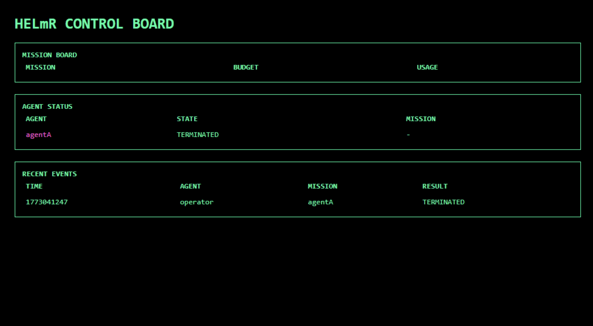

HELmR

Deterministic runtime control layer for autonomous agents

HELmR sits between agents and the systems they interact with.
Agents do not execute actions directly — every action must pass through HELmR.

HELmR enforces execution rules automatically using:

mission budgets

capability tokens

a controlled execution airlock

Screenshot

The control board displays:

Mission budgets

Agent status

Recent execution events

Example:

HELmR CONTROL BOARD

MISSION BOARD
AGENT STATUS
RECENT EVENTS
What HELmR Does

HELmR enforces deterministic runtime governance.

Features:

Mission creation with action budgets

Authorization gate for agent actions

Single-use capability tokens

Execution through a controlled airlock

Automatic mission spend tracking

Agent termination with tomb-state blocking

Live runtime control board

Agents cannot execute actions outside HELmR.

Architecture
Agent
  ↓
HELmR Authorization
  ↓
Capability Token
  ↓
Airlock Execution
  ↓
Filesystem / External Systems

All execution authority flows through HELmR.

Run Locally
Requirements

Rust

Cargo

Start HELmR
cargo run
Open the control board
http://127.0.0.1:7070/console/board
Demo
1. Create a mission
POST /mission/create
2. Authorize an action
POST /authorize
3. Execute through the airlock
POST /airlock/write_file
4. Terminate an agent
POST /control/terminate

Watch the control board update in real time.

Endpoints
Endpoint	Description
/mission/create	Create a mission with a spend limit
/authorize	Request authorization for an action
/airlock/write_file	Execute a file write through the airlock
/control/terminate	Terminate an agent
/console/board	View the live control board
Project Status

HELmR v2 implements the core deterministic governance loop:

mission budgeting

authorization control

capability tokens

airlock execution

termination enforcement

runtime observability

License

MIT

## Demo Video

[Watch the HELmR Demo](Helmr Demo Video.mp4)